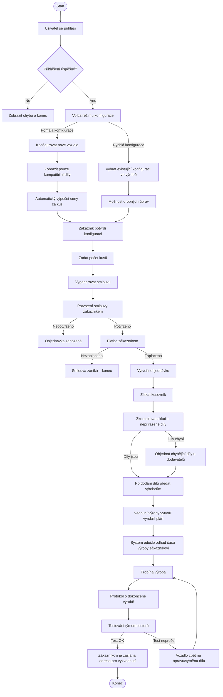

| Popis projektu                                                                                                                                                                  | Objektivne overitelne ukazatele                                                                                     | Prostredky overeni                                                                                                                            | Predpoklady                                                                                             |
| ------------------------------------------------------------------------------------------------------------------------------------------------------------------------------- | ------------------------------------------------------------------------------------------------------------------- | --------------------------------------------------------------------------------------------------------------------------------------------- | ------------------------------------------------------------------------------------------------------- |
| Cil projektu: Modernizovat armadu vcas                                                                                                                                       | Snizeni nakladu na vyvoj alespon o 30% Zkraceni doby vyvoje alespon o 20%                                        | Financni reporty Srovnani s predchozimi vyvoji                                                                                             | Dostatecny rozpocet na vyvoj Podpora vedeni Dostupnost k technologiim                             |
| Ucel projektu: Pred vyrobou prototypu otestovat vozidlo radou simulaci a opravit jakekoliv nalezene vyvojove vady Vytvorit system ktery zefektivni vyvoj bojoveho vozidla | 90% identifikovanych a opravenych konstrukcnich zavad jeste pred stavbou prototypu                                  | Reporty o nalezeni a opraveni zavad                                                                                                           | Presnost simulace Spoluprace vsech tymu Kvalitni vstupni data                                     |
| Vystupy: Funkcni informacni system pripraveny pro nasazeny                                                                                                                   | Nasazeny system do 6 mesicu Knihovna obsahujici alespon 50 scenaru pro simulace Kompletni dokumentace systemu | Protokol o prijeti systemu do provozu Katalog scenaru Digitalni dokumentace                                                             | Vykonny hardware kvalifikovany team vyvojaru a team schopny vytvaret simulace                        |
| Cinnosti: Poskladani teamu analyza zadani nakup hardwaru (pokud je potreba) vyvoj systemu testovani systemu trening uzivatelu                                 | Financni prosredky na nakup hardwaru                                                                                | mam poskladany team analyza byla provedena potrebny hardware byl zajisten uspesna testovaci verze uspesne zauceni vsech uzivatelu | Dostatecny rozpocet dostatecne znale analytiky a vyvojare schopne uzivatele se naucit novym vecem |
Tato semestralni prace je o zavedeni configuracniho objednavaciho systemu pro firmu vyrabejici bojova vozidla.
Z duvodu rozsireni nasi firmy jsme se rozhodli o zavedeni noveho systemu reseni objednavek, ktery ulehci obchodnimu oddeleni praci, tim ze zakaznik si bude moci z pohodli domova nakonfigurovat a objednat vozidlo podle jeho potreb z jiz znamych dilu a modulu, pokud nebude spokojen s konfiguraci, tak bude moci zkontaktovat obchodni oddeleni a vytvori se "custom" objednavka, ktera bude konzultovana a vyvyjena samostatne. Pote se objednavka zasle technickemu teamu ktery posoudi, zda vubec maji na takovou objednavku prostredky, pokud ano urci odhadovany termin a cenu za kus, tyto odhady jdou zpet za zakaznikem, ktery bud potvrdi objednavku a podepise ze ruci za to ze zaplati nebo ji zrusi. Po potvrzene objednavce jde plan na vyrobni oddeleni, kde planovac vyroby vytvori seznam vsech potrebnych dilu podle objednavky a vytvori plan vyroby, ktery je rozdelen podle pooddeleni vyroby, seznam dilu zasila na sklad, kde zkontroluji zda-li maji vse co je na seznamu, pokud ne, doobjednaji. Plan vyroby zasle hlavnimu mistrovy vyroby, ten jej zkontroluje, zdali neudelal planovac nejake nemozne pozadavky (viz od dvou dnu chci alespon 300 vezi), pokud je v poradku tak jej rozesle mistrum pooddeleni, kazdy mistr pak rozda praci pracovnikum. Po dokonceni objednavky je zakaznik vyzvan aby zaplatil, pokud neucini, vyresi to pravnicke oddeleni, pokud zaplati, obchodni oddeleni obeznami vedouciho oddeleni pro transport s objednavkou, ten vytvori plan transportu, podle ktereho bou pak vozidla transportovana na misto dohodnute s zakaznikem, ALE pokud si zakaznik zvoli svuj vlastni zpusob transportu tak bude kontaktovan a s obchodnim oddelenim se dohodnou na datu, kdy si zakaznik vozidla odveze

*takze jakoby, zakaznik proste v GUI naklikava postupne co povazuje za spravnou konfiguraci, system automaticky reaguje a zobrazuje mu jen kompatibilni moznosti, zaroven s predpokladanymi parametry (delo s touhle munici ma tolik penetrace), zaroven je tam predpokladana cena, pokud to nenajde tak zavola ty firme na custom objednavku, pak tedy zaklikne objednat, kde se zarucuje ze zakazku zaplati, inzenyri obdrzi objednavku a bud ji schvali nebo odduvodni proc by nesla a nabidnou alternativu/odduvodni proc nemuzou ji vzit (nedostatek xxx), kdyz ji schvali tak to poslou na vyrobni oddeleni, kde objednaji na dili, pockaji na dili, pak to smontujou, pak to prenechaji testovacimu teamu, ktery vozidla projdou a zkontrolujou zda je vse ok, pokud jo tak je to brane za dokonceno, pokud ne tak dostane nekdo zprda, pak platba, kdyz se nepovede, nabidnout jinou methodu platby, nebo vymahat penize, kdyz se povede tak konec*

## Logický rámec
---
### Cíl projektu
*Zefektivnění celého výrobního procesu od zakázky po dodání pomocí digitalizace a automatizace.*

| Objektivně ověřitelné ukazatele                        | Prostředky ověření                                                          | Předpoklady                                                    |
| ------------------------------------------------------ | --------------------------------------------------------------------------- | -------------------------------------------------------------- |
| Snížení doby zpracování objednávky o 40 % do 12 měsíců | Reporty z ERP systému (průměrná doba zpracování objednávky)                 | Projekt je v souladu se strategií firmy na digitalizaci výroby |
| Snížení chybovosti v konfiguraci objednávek na 0,5 %   | Reporty z kontrol kvality (počet reklamací způsobených chybnou konfigurací) | Vedení firmy poskytne dostatečnou podporu a financování        |
| Zvýšení spokojenosti zákazníků o 25 % (měřeno NPS)     | Dotazník spokojenosti zákazníků (NPS skóre)                                 |                                                                |

---
### Účel projektu
*Vyřešení problémů s manuální, chybovatelnou konfigurací a nepropojeností systémů mezi odděleními.*

| Objektivně ověřitelné ukazatele | Prostředky ověření | Předpoklady |
|---------------------------------|-------------------|-------------|
| Plně funkční a integrovaný konfigurátor využívaný minimálně 80 % zákazníky | Testovací scénáře a acceptance testy | Uživatelé (zákazníci, pracovníci) jsou ochotni systém používat |
| Automatické generování objednávek do výroby a k dodavatelům bez zásahu člověka | Monitorování logů a metrik využití systému | Externí systémy dodavatelů mají dostupné API pro integraci |
| Snížení čekací doby na vyjádření skladu a nákupu z 48 hodin na 0 | Pravidelné reporty z výroby a nákupu | |

---
### Výstupy
*Softwarový systém zahrnující konfigurátor, backend a integrace.*

| Objektivně ověřitelné ukazatele | Prostředky ověření | Předpoklady |
|---------------------------------|-------------------|-------------|
| Funkční konfigurátor s UI pro zákazníky včetně přihlášení | Funkční demonstrace systému | Vývojový tým má potřebné technické znalosti |
| Modul pro správu kompatibility dílů a automatickou kalkulaci | Dokumentace k API a databázi | Byly alokovány dostatečné vývojové kapacity |
| Integrační modul pro sklad, výrobu a dodavatele | Testovací data a reporty z integračních testů | Nedošlo ke změně business požadavků během vývoje |
| Reportovací dashboard pro vedení výroby | | |

---
### Činnosti
*Hlavní fáze vývoje softwaru.*

| Objektivně ověřitelné ukazatele                 | Prostředky ověření                                                     | Předpoklady                                     |
| ----------------------------------------------- | ---------------------------------------------------------------------- | ----------------------------------------------- |
| Analýza a specifikace požadavků - 40 hodin      | Výstupní dokumenty z každé fáze (specifikace, diagramy, zdrojové kódy) | Tým má přístup k potřebným nástrojům a systémům |
| Návrh datového modelu a architektury - 60 hodin | Pravidelné revize a schvalování                                        | Byly uzavřeny potřebné licence pro vývoj        |
| Vývoj konfigurátoru a backendu - 200 hodin      |                                                                        | Klíčoví uživatelé jsou dostupní pro konzultace  |
| Implementace integrací - 120 hodin              |                                                                        |                                                 |
| Testování a nasazení - 80 hodin                 |                                                                        |                                                 |

```mermaid
flowchart LR

%% ==============================
%% POOL: ZÁKAZNÍK
%% ==============================
subgraph A[Zákazník]
    A1([Start])
    A2[Zákazník se přihlásí]
    A3{Přihlášení OK?}
    A4[Zvolí režim konfigurace]
    A5[Konfiguruje vozidlo / upraví existující]
    A6[Potvrdí konfiguraci]
    A7[Zadá počet kusů]
    A8[Schválí smlouvu]
    A9[Zaplatí]
    A10([Čeká na výsledek])
    A11([Konec pro zákazníka])
end

%% ==============================
%% POOL: SYSTEM
%% ==============================
subgraph B[System]
    B1[Ověření přihlášení]
    B2[Zobrazení režimů konfigurace]
    B3[Zobrazení kompatibilních dílů]
    B4[Výpočet ceny za kus]
    B5[Vygenerování smlouvy]
    B6[Vytvoření objednávky]
    B7[Vytvoření kusovníku]
    B8[Kontrola skladu]
    B9[Objednání chybějících dílů]
    B10[Předání výroby]
    B11[Zobrazení odhadu doby výroby]
    B12[Příjem výrobního protokolu]
    B13[Příjem výsledků testů]
    B14[Odeslání adresy pro vyzvednutí]
end

%% ==============================
%% POOL: SKLAD
%% ==============================
subgraph C[Sklad]
    C1[Kontrola dostupných dílů]
    C2[Příjem dodaných dílů]
end

%% ==============================
%% POOL: VÝROBA
%% ==============================
subgraph D[Výroba]
    D1[Příjem objednávky k výrobě]
    D2[Vytvoření výrobního plánu]
    D3[Samotná výroba]
    D4[Vytvoření výrobního protokolu]
end

%% ==============================
%% POOL: TESTING
%% ==============================
subgraph E[Testing]
    E1[Testování vozidla]
    E2{Test OK?}
    E3[Vrácení do výroby k opravě]
end

%% ==============================
%% TOKY MEZI POOLY
%% ==============================

A1 --> A2 --> B1
B1 --> A3

A3 -->|Ne| A11
A3 -->|Ano| B2 --> A4

A4 --> A5 --> B3 --> B4 --> A6
A6 --> A7 --> B5 --> A8

A8 -->|Neschváleno| A11
A8 -->|Schváleno| A9 --> B6

B6 --> B7 --> B8 --> C1

C1 -->|Díly chybí| B9 --> C2 --> B8
C1 -->|Díly OK| B10 --> D1

D1 --> D2 --> B11 --> A10
D2 --> D3 --> D4 --> B12 --> E1

E1 --> E2
E2 -->|Ne| E3 --> D3
E2 -->|Ano| B13 --> B14 --> A11
```

